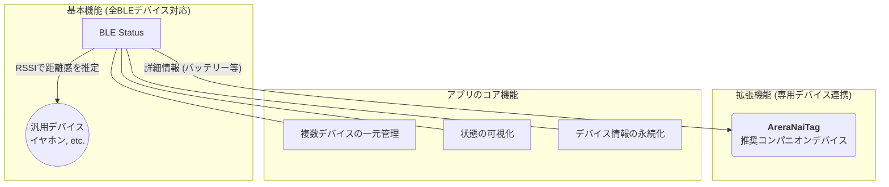
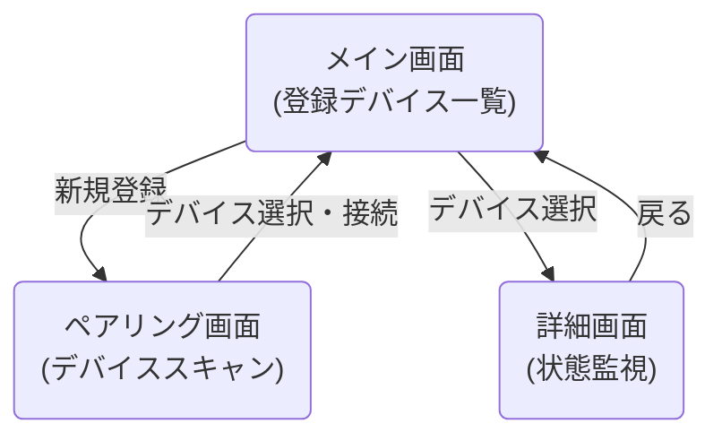

# Flutterアプリ「BLE Status」発表資料案

## 1. はじめに

- **アプリケーション名:** BLE Status
- **コンセプト:** **「あらゆるBLEデバイスを追跡し、専用デバイスで真価を発揮する」**
- **目的:**
    - **汎用性:** イヤホン等の手持ちのBLEデバイスを、接続状況や距離感で管理し、置き忘れを防ぐ。
    - **高機能性:** 専用コンパニオンデバイス**「AreraNaiTag」**と連携し、バッテリー残量など、よりリッチな情報を取得して紛失を未然に防ぐ。

---

## 2. システム構成

アプリは汎用デバイスと専用デバイスの両方に対応し、それぞれの利点を活かした追跡が可能です。

---

## 3. アプリケーションの機能

### 機能の二段階構成

| 機能レベル | 対象デバイス | 主な機能 | アピールポイント |
|---|---|---|---|
| **基本機能** | **全てのBLEデバイス** | ・RSSIに基づく接続状態と距離感の表示 ・デバイスの登録・管理 | **手軽さ:** 追加コストなしで、手持ちのデバイスをすぐに追跡開始できる。 |
| **拡張機能** | **専用デバイス 「AreraNaiTag」** | ・リアルタイムでのバッテリー電圧表示 ・（将来的に）ボタン押下によるスマホ呼び出し | **高信頼性:** アプリと完全に連携設計されており、より正確で詳細な情報を得られる。 |

---

## 4. 画面遷移図

シンプルな3画面構成で、誰でも簡単に操作できます。

---

## 5. 技術的ハイライト

本アプリケーションの「汎用性」と「高機能性」を両立させる、2つのコア技術です。

1.  **RSSIによる汎用トラッキング技術**
    - `flutter_blue_plus` を活用し、デバイスの**RSSI（受信信号強度）**を共通指標として利用。
    - これにより、GATTサービスの仕様に依存しない、**あらゆるBLEデバイスとの基本的な連携**を可能にしました。

2.  **GATT Notifyによる高度なデバイス連携**
    - **AreraNaiTag**が持つ独自のGATTサービスと通信。
    - キャラクタリスティックの**Notify機能**を活用し、バッテリー電圧の変化などをデバイスからリアルタイムで受信。
    - アプリの汎用性を保ちつつ、特定デバイスとの連携を深める**拡張性の高いアーキテクチャ**を実現しました。

3.  **Flutterによる効率的なクロスプラットフォーム開発**
    - 単一コードベースでiOS/Androidに対応し、迅速な開発と一貫したユーザー体験を提供します。

---

## 6. (Appendix) AreraNaiTag 連携仕様

- **ターゲットサービス: `FeatherTagService`**
  - **UUID:** `8f2c7e40-9f2f-4dcb-bd79-bc0f2a06d3a1`

- **利用キャラクタリスティック**
| 名称 | UUID | プロパティ | 利用方法 |
|---|---|---|---|
| **Battery Voltage** | `8f2c7e43-9f2f-4dcb-bd79-bc0f2a06d3a1` | `READ`, `NOTIFY` | **READ:** 接続時に電圧を一度取得。 **NOTIFY:** 電圧変化の通知を購読し、UIをリアルタイム更新。 |

---

## 7. プレゼンテーション作成に向けて

- **LLMへの指示例（例）:**
  - `「この資料案を基に、『汎用トラッカーアプリと、その真価を引き出す専用デバイス』という二段構えのコンセプトで、技術発表会用のパワーポイントを10枚で作成してください。特に、汎用性と専用デバイスによる拡張性の両立が技術的な強みであることを強調してください。」`
  - `「この資料のコンセプトと機能を基に、ハードウェア（AreraNaiTag）とソフトウェア（アプリ）をセットで販売するための、投資家向けピッチ資料（3枚）を作成してください。」`